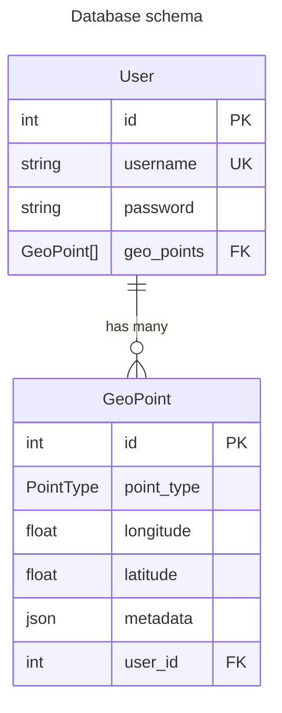

```mermaid
---
title: Database schema
---
erDiagram
    User {
        int id PK
        string username UK
        string password
        GeoPoint[] geo_points FK
    }

    GeoPoint {
        int id PK
        PointType point_type
        float longitude
        float latitude
        json metadata
        int user_id FK
    }

    User ||--o{ GeoPoint : "has many"
```